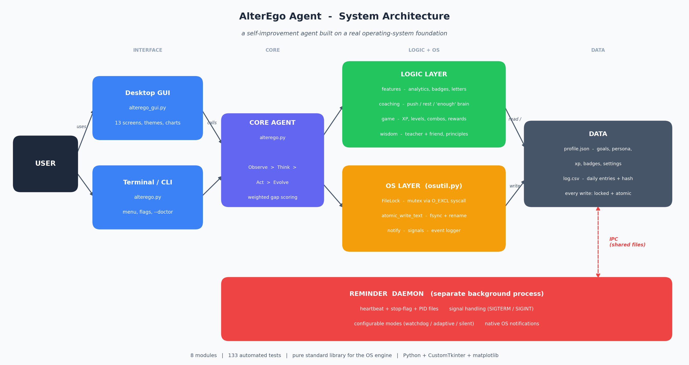

# AlterEgo Agent

> An AI agent that simulates a smarter version of you, measures the gap between
> who you are and who you want to be, and coaches you to close it.

This is my final project for Operating Systems (004310-006). On the surface it is
a self-improvement app. Underneath it is a real operating-systems project: a
background daemon, file locking, atomic writes, signals, and inter-process
communication. I cared about both halves equally, the part that feels human and
the part that is correct.

Built by **Prodipta Acharjee**.

---

## Why I built it

Most people already know what they should be doing. The problem is never the
knowing, it is the gap between intention and action, and almost nothing actually
coaches you through that gap. To-do apps just list tasks. They do not think, they
do not know when you are struggling, and they definitely do not know when to ease
off.

So I built an agent that creates a digital version of your ideal self, your
"AlterEgo", and every day compares what you actually did against what that ideal
self would have done. It scores the gap, tells you the one thing to fix, and over
time it gets smarter about you. The thing I wanted most was for it to feel like a
teacher and a friend at the same time. Strict enough to push you to your edge,
kind enough to take you in its arms on the days life is too heavy.

---

## What it does

The core loop, every day:

- You rate your energy and mood, then log what you actually did per goal.
- It scores you out of 100 using a weighted gap formula.
- It picks a **stance** (push, steady, celebrate, recover, or grace) and explains
  its reasoning in plain language.
- Two voices respond: **the teacher** gives the firm truth, **the friend** keeps
  you grounded.
- It knows when what you did was **enough**, judging your effort against your
  capacity that day, not against a perfect day.

On top of that:

- **Persona engine.** You name your AlterEgo, give it a voice (firm, warm, fierce,
  or playful) and a personality. All the feedback is in that voice.
- **Smart recovery and burnout detection.** Three bad days in a row eases your
  targets and softens the tone. It also watches your reflections and energy for
  signs you are burning out, and tells you to rest instead of pushing.
- **A game layer.** XP, levels, an evolving avatar, combos, a daily reward draw,
  badges, and the Procrastination Monster, so improving yourself feels like a
  game instead of a chore.
- **It adapts to your mood.** When you are depleted the whole interface goes calm
  and minimal. When you are thriving it surfaces the deeper features. Nothing is
  ever removed, the app just breathes with your state.
- **Retention by design.** Streak insurance forgives a missed day, a gentle
  comeback welcomes you back with no guilt, and a 10-second express check-in keeps
  the habit alive on low-energy nights.
- **Insights and patterns.** Correlation analysis on your own log: which goal
  moves your score most, your toughest weekday, habit stacks, trigger chains.
- **A philosophy layer.** State-aware principles (Stoic, Kaizen, self-compassion),
  growth seasons, and an identity line you write at setup.

It has two front-ends: a desktop window and a terminal app. The window is purely a
view, it calls the same logic underneath.

---

## The OS side (this is an OS course, after all)

The app and a background reminder daemon are two separate processes sharing the
same files. That one design choice is what pulls in every operating-system
concept, and none of them are bolted on. They are how the thing actually works.

| Concept | Where it lives | What it does |
|---|---|---|
| Mutual exclusion | `osutil.FileLock` | A lock file built on the atomic `O_CREAT \| O_EXCL` syscall acts as a mutex. Every read-modify-write on the shared data happens inside it. Proven by a test: 8 threads x 50 increments comes out to exactly 400, no lost updates. |
| Atomic writes | `osutil.atomic_write_text` | Writes to a temp file, `fsync`s it, then `os.replace`s over the target. A crash leaves the old or the new file, never a half-written one. |
| Daemon / detached process | `reminder_start`, `daemon_run` | A real background process spawned detached, living past the parent. |
| Signals | `daemon_run` | `SIGTERM` / `SIGINT` handlers so the daemon cleans up before exiting. |
| Inter-process communication | pid / status / stop files | The daemon writes a heartbeat ("alive at T"), the app reads it. The app writes a stop-flag, the daemon polls it. File-based IPC, no sockets. |
| OS notifications | `osutil.notify` | `user32.MessageBoxW` via ctypes on Windows, `osascript` on macOS, `notify-send` on Linux. |
| Data integrity | per-row SHA-256 hash | Every log row stores a hash of its key fields, so edits made outside the app are flagged as tampered. |
| Crash recovery / audit | `audit_state`, corruption quarantine | A bad profile is quarantined and rebuilt; a launch audit cleans up stale PIDs and leftover temp files. |

If you want to see all of this proven in one command:

```
python alterego.py --doctor
```

It acquires the lock and confirms a second acquirer is blocked, performs an atomic
write and verifies it, checks the daemon, validates every log row's hash, and runs
the state audit.

---

## System diagram



The app and a background daemon are two separate processes that coordinate
through shared files. The interface layer (GUI and CLI) only renders. The core
agent runs the daily loop. The logic modules handle the thinking and the OS
layer handles the locking, atomic writes, signals, and notifications. Every read
and write to the data files goes through the lock and the atomic writer.

---

## Tech stack

- **Python 3** for everything.
- **Standard library** for the entire agent and all of the OS work (no third party
  code for the lock, the daemon, the IPC, the notifications, the hashing).
- **customtkinter** for the desktop window.
- **matplotlib** for the charts (the terminal falls back to ASCII if it is not
  installed).

---

## Getting started

You need Python 3.8 or newer.

```
git clone https://github.com/YOUR_USERNAME/alterego-agent.git
cd alterego-agent
pip install -r requirements.txt
```

Run the desktop app:

```
python alterego_gui.py
```

Or the terminal version:

```
python alterego.py
```

On first launch it walks you through building your AlterEgo. After that, just
check in once a day.

---

## Usage

The desktop window is the easy way in. For the terminal there is also a full
command-line interface:

```
python alterego.py --checkin        one daily check-in
python alterego.py --report         performance and growth report
python alterego.py --insights       what actually moves your score
python alterego.py --patterns       behavioral patterns (needs 10+ days)
python alterego.py --letter         the latest weekly letter
python alterego.py --scorecard      export a one-page score card
python alterego.py --chart          score-trend chart
python alterego.py --heatmap        year heatmap
python alterego.py --level          your XP and level
python alterego.py --export         back up your data to a zip
python alterego.py --doctor         self-diagnostic of the OS engine

python alterego.py --reminder-start
python alterego.py --reminder-status
python alterego.py --reminder-stop
```

---

## Running the tests

```
python -m unittest discover -p "test_*.py" -v
```

There are 133 tests across the project covering the gap math, streaks, the lock
under real thread contention, atomic writes, corruption recovery, the coaching
stances, the "enough" logic, the game mechanics, the retention systems, the
wisdom layer, and a lot of bad-data and edge-case handling.

---

## Project structure

```
alterego.py         the agent: 6-phase loop, menu, CLI, reminder daemon
alterego_gui.py     the desktop window (CustomTkinter), pure UI
osutil.py           OS primitives: FileLock, atomic_write_text, notify, logger
features.py         analytics + persona: scoring, badges, patterns, letters, backup
coaching.py         the decision brain: stance, reasoning, the "enough" check, UI density
game.py             the fun: XP, levels, combos, draws, the monster, jokes
wisdom.py           the soul: teacher/friend voices, principles, growth seasons
test_*.py           133 tests
DOCUMENTATION.md    the deeper technical write-up
```

The data files (`alterego_profile.json`, `alterego_log.csv`, and the daemon's
control files) are created at runtime and are not part of the source. They are in
`.gitignore`.

---

## License

MIT. Do whatever you want with it, just keep the copyright notice. See
[LICENSE](LICENSE).

---

## Author

Prodipta Acharjee. Built as a final project for Operating Systems, 2026.
